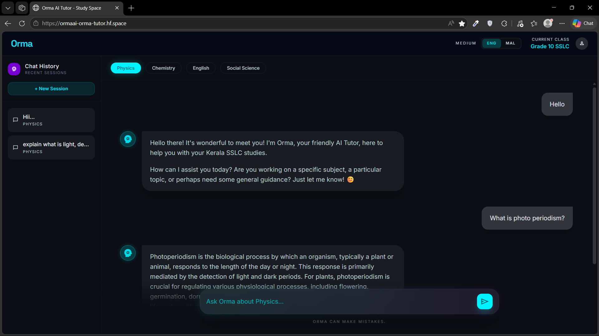
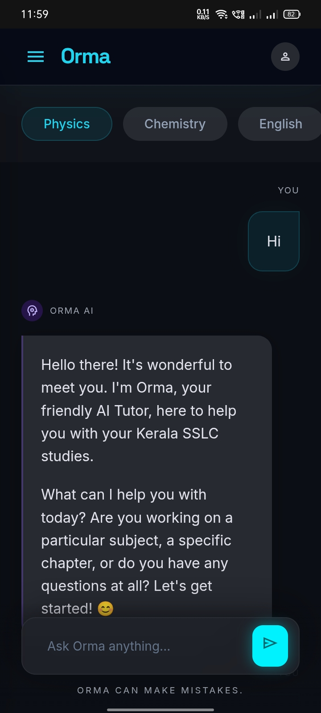

**Orma**

Orma is a Retrieval-Augmented Generation (RAG) AI application engineered specifically to serve as a tutor for Kerala SSLC students. The system architecture utilizes Supabase for vector storage and Gemini 2.5 Flash-Lite for inference, deployed as a monolithic FastAPI application designed for serverless environments like Hugging Face Spaces.

**Interface Overview**

<table>
  <tr>
    <td valign="top" width="70%">
      <b>Desktop Interface</b> 
      
    </td>
    <td valign="top" width="30%">
      <b>Mobile Interface</b> 
      
    </td>
  </tr>
</table>

**System Architecture**

The project is segmented into four operational phases:

### [Phase 1: Data Pipeline](./phase1_data_pipeline)
Handles the ingestion and vectorization of SSLC textbook PDFs.
* **Extraction:** Gemini 2.5 Pro Vision-OCR parses textbook PDFs into local, ephemeral Markdown artifacts (`.txt`).
* **Ingestion:** Raw HTTP REST batch requests bypass standard SDKs to generate embeddings via the `gemini-embedding-2-preview` model, chunking and syncing the local text directly to the Supabase PostgreSQL database.

### [Phase 2: Backend Services](./phase2_backend)
A high-performance API routing and logic layer built on FastAPI.
* **RAG Retrieval:** Executes raw HTTP POST requests to a custom Supabase RPC (`hybrid_search_v2`).
* **Caching:** Implements a localized, dictionary-based LRU cache to optimize retrieval latency.
* **Inference:** Gemini 2.5 Flash-Lite handles stateful conversation logic.
* **Middleware:** Implements Server-Sent Events (SSE) for streaming, Cross-Origin Resource Sharing (CORS), and SlowAPI rate-limiting keyed dynamically by a custom `X-Session-ID` to support users behind shared educational NAT gateways.
* **Security:** Utilizes regex-based character deletion to strip XML-style angle brackets, mitigating prompt injection vectors.

### [Phase 3: Client Interface](./phase3_frontend)
A lightweight, zero-build-step frontend implementation served directly by the backend.
* **Architecture:** Two isolated HTML/JS entry points (`Desktop_code.html` and `Mobile_code.html`) routed dynamically via User-Agent evaluation.
* **Dependencies:** Tailwind CSS (styling), marked.js (Markdown parsing), KaTeX (mathematical rendering), and DOMPurify (XSS mitigation).

### [Phase 4: Evaluation Framework](./phase4_evaluation)
Automated and manual evaluation of RAG retrieval quality and LLM response accuracy.
* **Framework:** Ragas (Faithfulness and Answer Relevancy metrics).
* **Execution:** Bypasses the backend API to directly benchmark the Gemini SDK against static local JSON datasets.
* **Review:** Generates structured JSON artifacts for Human-In-The-Loop (HITL) manual inspection.

**Deployment & Security**

All credentials, API keys, and database URLs **must** be managed via environment variables (`.env` for local development, or the platform-specific Secrets UI in Hugging Face for production). Hardcoding sensitive data in this repository is strictly prohibited.